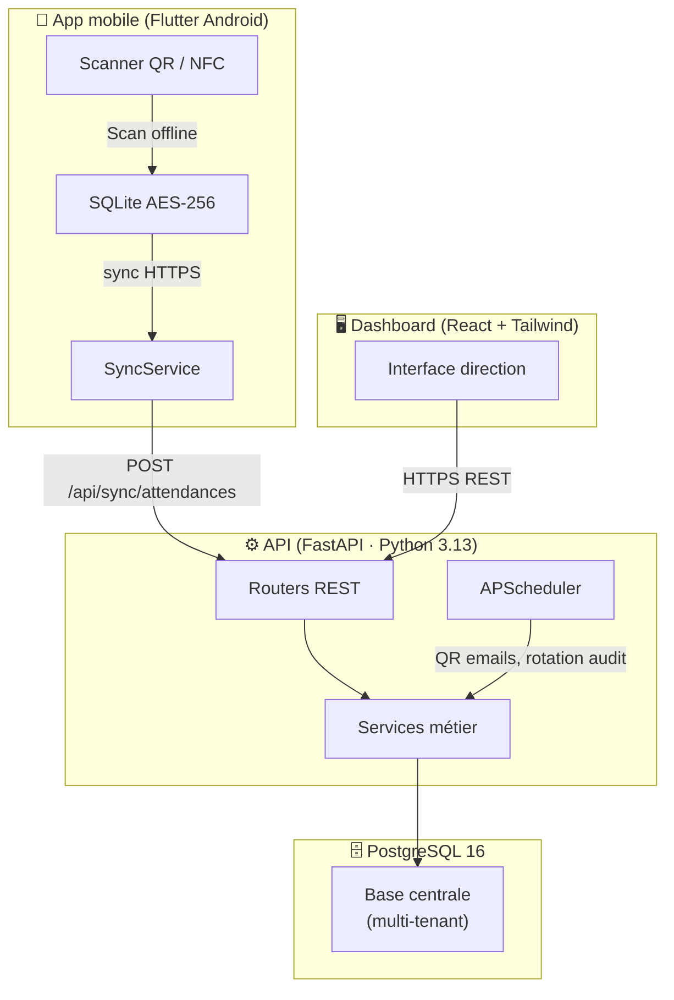
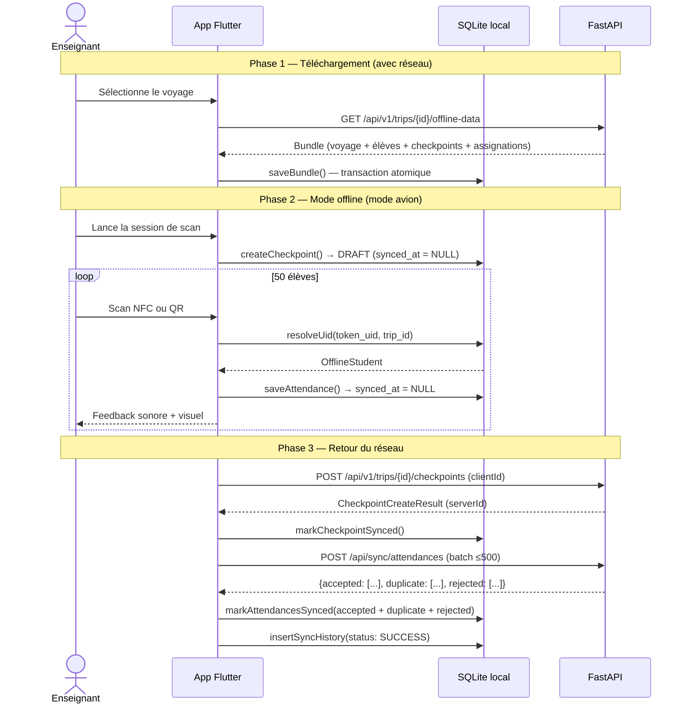
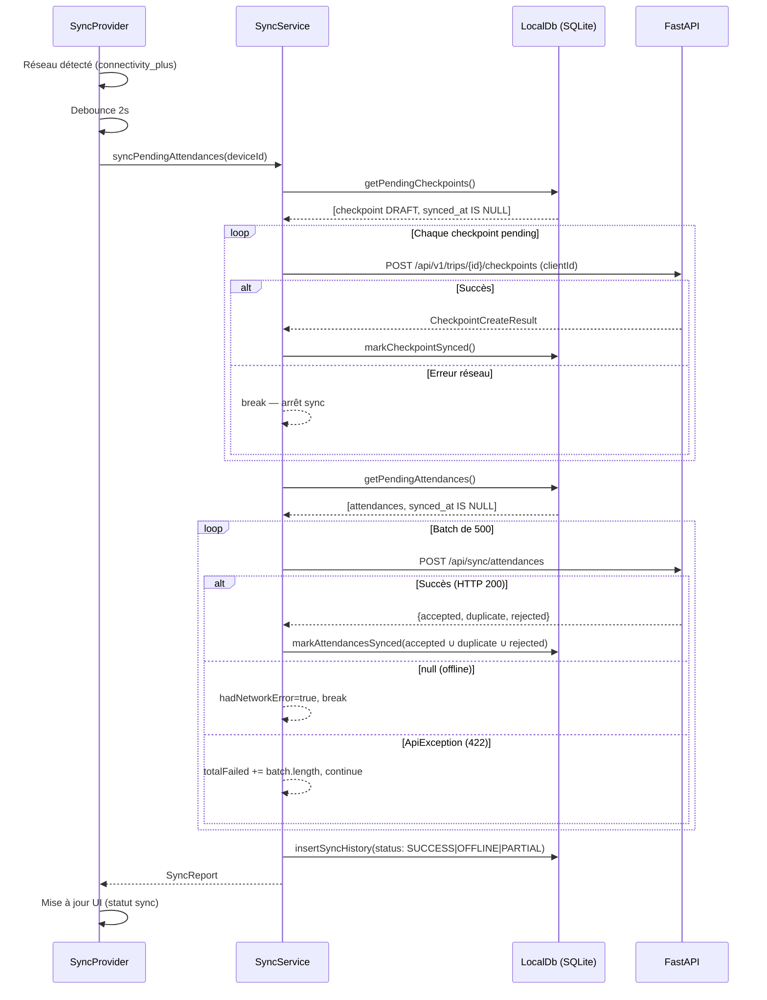
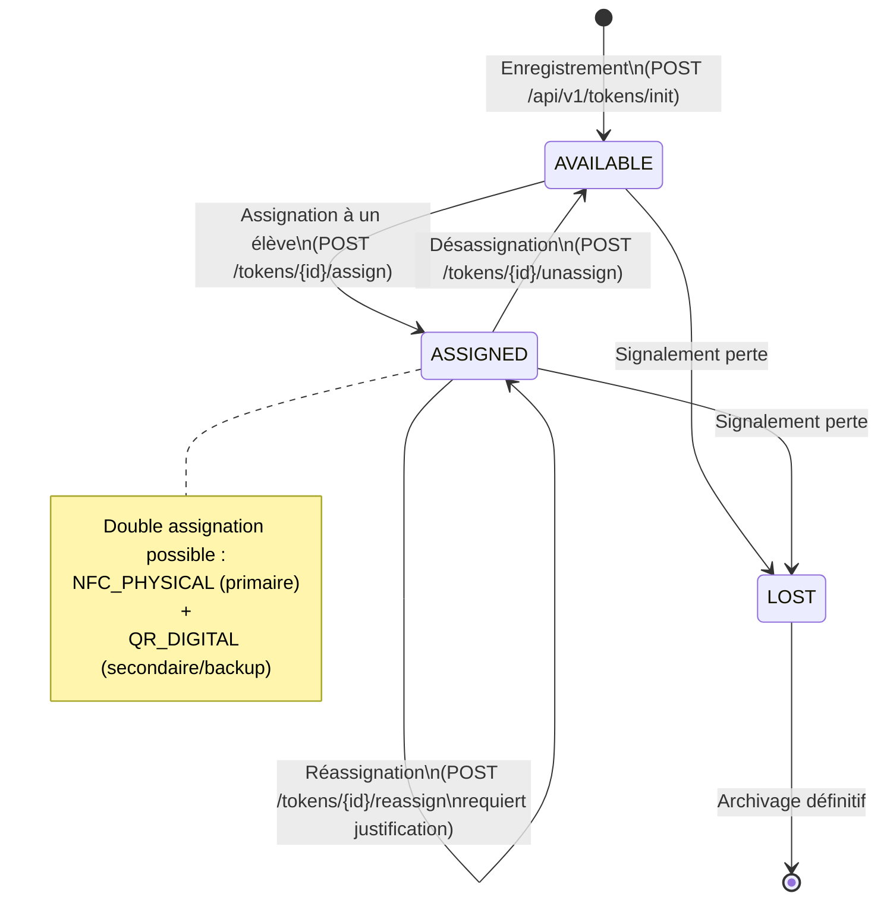
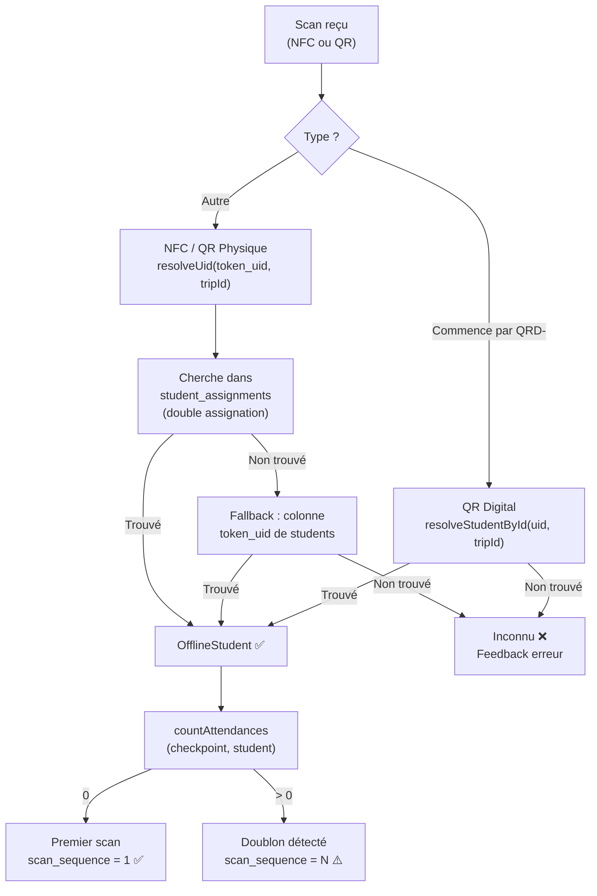
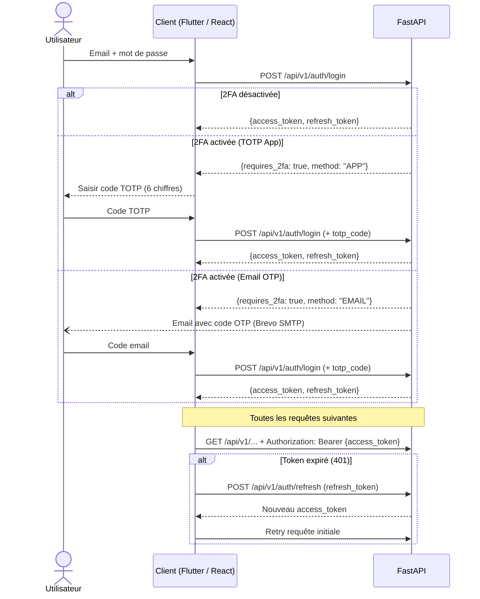
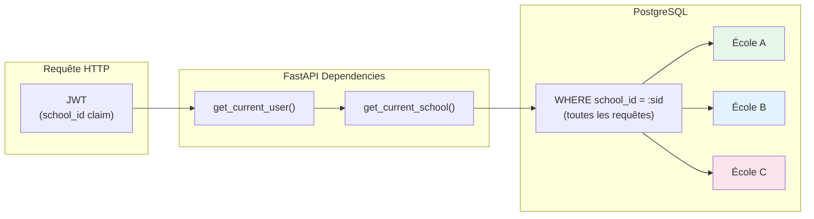

# Architecture SchoolTrack — Diagrammes techniques

Ce document présente les flux critiques de l'application sous forme de diagrammes de séquence et d'état (syntaxe Mermaid).

---

## 1. Vue d'ensemble du système

---

## 2. Flux scan offline-first (US 2.2 + US 3.1)

Scénario : l'enseignant télécharge les données du voyage, part en sortie sans réseau, scanne 50 élèves, puis synchronise au retour.

---

## 3. Flux de synchronisation (US 3.1 — détail SyncService)

---

## 4. Cycle de vie d'un token (bracelet NFC / QR)

---

## 5. Résolution d'identité lors du scan (HybridIdentityReader)

---

## 6. Flux d'authentification (US 6.1 + 2FA)

---

## 7. Isolation multi-tenant (US 6.6)

Chaque token JWT contient le `school_id` de l'utilisateur. Toutes les requêtes SQL filtrent automatiquement par `school_id` via les dépendances FastAPI — aucune donnée d'une école n'est accessible depuis une autre école.

---

## 8. Schéma de base de données (tables principales)

(à compléter)
